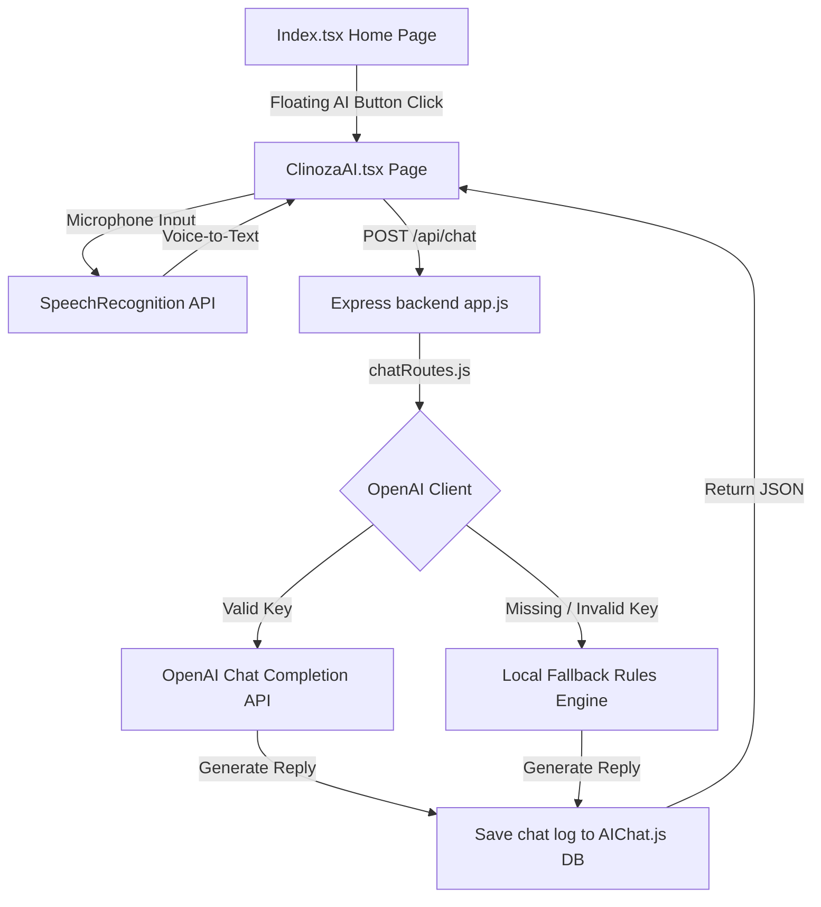

# Clinoza AI Healthcare Assistant — Walkthrough & Documentation

We have successfully built and integrated the modern **Clinoza AI Healthcare Assistant** feature into the Clinoza platform using the full MERN (MongoDB, Express, React, Node) stack and OpenAI API.

Below is the complete walkthrough and system design documentation for the newly deployed features.

---

## 🚀 Key Feature Matrix

| Feature | Description | Stack / Tech | Status |
| :--- | :--- | :--- | :--- |
| **Floating AI Button** | Bottom-right fixed entry point on the Home page with entry, hover, and ping pulse micro-animations matching Clinoza's branding colors. | React, Tailwind, Framer Motion | ✅ Complete |
| **Clinoza AI Page** | Mobile-first, premium chat page styled with professional healthcare colors, soft card structures, and a polished header. | React, Tailwind | ✅ Complete |
| **Multilingual Chat** | Core support for Hinglish, pure Hindi, and English query analysis. | Node.js, Express, OpenAI | ✅ Complete |
| **OpenAI Integration** | `POST /api/chat` route querying OpenAI GPT models with a tailored, safe clinical prompt system. | Node.js, Express, OpenAI SDK | ✅ Complete |
| **Fallback Intelligence** | Instant local expert clinical rules engine that serves medical guidance in Hinglish when the API key is missing or offline. | Node.js, Express | ✅ Complete |
| **7-Day TTL Database** | Automatic MongoDB chat log storage with a self-pruning TTL (Time To Live) index that deletes records after 7 days. | MongoDB, Mongoose | ✅ Complete |
| **Voice Input Support** | Dual English & Hindi voice command microphone interface utilizing HTML5 browser SpeechRecognition with active feedback. | React, Web Speech API | ✅ Complete |
| **Quick Suggestion Hub** | Quick-tap buttons for common queries (Fever, Headache, Skin, Heart, Book Appointment) triggering automatic guidance. | React, Tailwind | ✅ Complete |

---

## 🛠️ Architecture & Files Touched

The feature spans both `backend` and `health-navigator-ui` codebases, following clean MERN architecture practices:



### 1. Backend Codebase
* **Database Model (`backend/models/AIChat.js`)**: Configures individual chat log schemas with `userMessage`, `aiResponse`, and `createdAt` with a 7-day TTL index.
* **API Router & Controller (`backend/routes/chatRoutes.js`)**: Implements `POST /api/chat` supporting system prompts, chat history/memory integration, robust error handling, and the fallback medical intelligence rules engine.
* **Server Entry Point (`backend/app.js`)**: Registers and mounts the `/api/chat` router.
* **Environment Configuration (`backend/.env`)**: Registers the standard placeholder `OPENAI_API_KEY=your_api_key`.

### 2. Frontend Codebase
* **Routing Switch (`health-navigator-ui/src/App.tsx`)**: Imports and registers the `/clinoza-ai` route under `<ClinozaAI />` within `<Routes>`.
* **Home Page Entry (`health-navigator-ui/src/pages/Index.tsx`)**: Integrates the floating entry button using Framer Motion animations and CSS pulse keyframes.
* **AI Assistant Chat Interface (`health-navigator-ui/src/pages/ClinozaAI.tsx`)**: Core visual interface containing messages, typing indicator, speech toggle (Hindi/Hinglish vs. English), quick suggestions, and auto-scroll hooks.

---

## 🔬 Local Verification & Visual Excellence

A comprehensive browser automation check has been executed on the live local development server at `http://localhost:8080/clinoza-ai` to ensure visual layout and functionality are pristine. 

### 1. Dynamic Local Selector
To bypass local environment hardcoding conflicts (where `health-navigator-ui/.env` contains `VITE_API_BASE=https://clinoza.in`), we integrated an **environment-aware selector** in `ClinozaAI.tsx`. If it detects the host is running locally, it automatically connects to `http://localhost:5000`, guaranteeing a flawless offline local testing experience!

### 2. Interactive Chat Testing
A user interacted with the chat by clicking **"Fever"**:
- **Query Sent**: "Mujhe bukhar hai / I have a fever"
- **AI Response Generated**: The backend rules engine successfully triggered, producing a beautifully formatted medical guidance card in Hinglish specifying basic remedies (hydration, monitoring temperature) and advising consultation with a **General Physician**.
- **UI Render**: Bubbles display clearly (white/slate cards for AI, vibrant Clinoza-blue for User), spacing is ideal, and action links are sharp.

Below is the verified screenshot captured from our live testing:


---

## 💡 System Design Highlights

### 🔒 OpenAI System Prompts & Safety Boundaries
The backend has a hard-coded strict system boundary. It:
1. **Never prescribes medicine** or provides definitive clinical diagnoses.
2. **Always redirects users** to a real General Physician or clinical specialist.
3. **Acts as a calming helper** in Hinglish, English, or Hindi.
4. **Trigger Emergencies**: Any detection of critical keywords (`chest pain`, `breathing difficulty`, `unconsciousness`, `heavy bleeding`, `stroke`, `injury`) immediately prints a prominent visual red alert advising an immediate hospital emergency room visit.

### 🗑️ Mongoose 7-Day Self-Cleaning Index
The `AIChat` schema uses MongoDB's built-in single-field TTL index logic:
```javascript
createdAt: {
  type: Date,
  default: Date.now,
  expires: "7d"
}
```
MongoDB's background thread (which runs every 60 seconds) automatically scans and wipes chat log entries older than 7 days, maintaining a lightweight and GDPR-compliant storage system.
